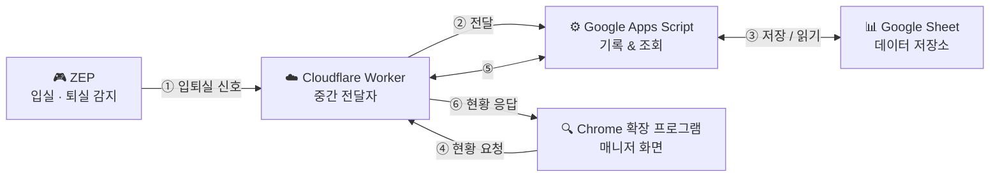

# ZEP Tracking Extension v1.2

ZEP 입실/퇴실 기록을 Google Sheet에 저장하고, 같은 트랙의 매니저들이 Chrome 확장 프로그램 사이드패널에서 현재 접속중/미접속 인원과 최근 로그를 함께 보는 도구입니다.

## 전체 구조

아래 그림처럼 ZEP에서 누군가 입실하거나 퇴실하면 신호가 자동으로 전달되고 저장됩니다. 매니저는 Chrome 확장 프로그램만 열면 실시간으로 현황을 볼 수 있습니다.



중요한 운영 원칙은 아래와 같습니다.

- **ZEP API 연결은 트랙당 1개**만 사용합니다.
- 같은 트랙에서는 대표 매니저 1명이 `Google Sheet`, `Apps Script`, `Cloudflare Worker`를 구성합니다.
- 다른 매니저들은 확장 프로그램만 설치하고 대표 매니저가 공유한 **같은 Worker URL**과 **같은 Google Sheet URL**을 입력합니다.
- 이렇게 하면 모든 매니저가 같은 접속 현황과 로그를 봅니다.

각 폴더의 역할은 이렇습니다.

| 위치 | 역할 |
| --- | --- |
| `apps-script/Code.gs` | Google Sheet에 기록하고 조회하는 서버 코드 |
| `cloudflare-worker/worker.js` | ZEP과 Apps Script 사이를 연결하는 필수 중간 코드 |
| `extension/` | Chrome에 설치하는 확장 프로그램 |

확장 프로그램 설정에는 URL을 2개 넣습니다.

| 설정 이름 | 의미 |
| --- | --- |
| Worker URL | 같은 트랙 매니저들이 모두 동일하게 입력하는 중앙 조회 주소입니다. |
| Google Sheet URL | 같은 트랙 매니저들이 함께 보는 시트를 바로 열기 위한 링크입니다. 데이터 연결용이 아닙니다. |

## 준비물

아래 계정과 프로그램이 필요합니다.

- Google 계정
- Chrome 브라우저
- ZEP 관리자 권한
- Cloudflare 계정

대표 매니저와 다른 매니저의 역할은 다릅니다.

| 역할 | 해야 할 일 |
| --- | --- |
| 대표 매니저 | 템플릿 시트 사본 만들기, Apps Script 배포, Cloudflare Worker 배포, ZEP API 연결 |
| 다른 매니저 | Chrome 확장 프로그램 설치, 공유받은 Worker URL과 Google Sheet URL 입력 |

## 대표 매니저 1단계: Google Sheet 사본 만들기

아래 링크에서 템플릿 시트를 사본으로 복사합니다. 시트 구조(탭, 컬럼명)가 미리 준비되어 있어서 직접 만들 필요가 없습니다.

➡️ **[ZEP Tracking 템플릿 시트 사본 만들기](https://docs.google.com/spreadsheets/d/1N-wFpOGlallKm3cfhTjKB6Mci8olek_v5rpeaHMlk_8/copy)**

1. 위 링크를 클릭합니다.
2. `사본 만들기` 창이 열리면 이름을 알아보기 쉽게 바꿉니다.
   - 예: `ZEP 출석 관리 - [트랙명]`
3. `사본 만들기`를 누릅니다.
4. 복사된 시트가 열리면 브라우저 주소창의 Google Sheet URL을 복사해둡니다.

시트 구조는 아래와 같이 미리 구성되어 있습니다.

| 시트 이름 | 컬럼 | 역할 |
| --- | --- | --- |
| `Mappings` | `realName`, `isStaff`, `userId`, `nickname` | ZEP 사용자와 실명을 연결하고 운영진 제외 여부를 관리하는 곳 |
| `Presence` | `userId`, `nickname`, `status`, `lastEnterAt`, `lastExitAt`, `lastEventAt` | 현재 접속 상태를 저장하는 곳 |
| `Events` | `receivedAt`, `zepDate`, `eventType`, `userId`, `nickname`, `mapHashId`, `rawJson` | 입실/퇴실 로그를 저장하는 곳 |
| `Diagnostics` | `receivedAt`, `stage`, `message`, `rawBody` | 오류나 진단 기록을 저장하는 곳 |

## 대표 매니저 2단계: Apps Script 배포하기

사본에는 Apps Script 코드가 이미 포함되어 있습니다. 코드를 따로 붙여넣을 필요 없이 바로 배포하면 됩니다.

> `/copy` 링크에서 **Apps Script 파일 보기** 버튼이 함께 보이는 경우, 무시하고 **사본 만들기**만 누르면 됩니다.

1. 복사한 Google Sheet를 엽니다.
2. 상단 메뉴에서 `확장 프로그램 > Apps Script`를 누릅니다.
3. Apps Script 화면 오른쪽 위의 `배포`를 누릅니다.
4. `새 배포`를 누릅니다.
5. 유형 선택에서 `웹 앱`을 선택합니다.
6. 설정을 아래처럼 맞춥니다.

| 항목 | 값 |
| --- | --- |
| 설명 | `ZEP Tracking v1.2` |
| 실행 사용자 | `나` |
| 액세스 권한 | `모든 사용자` |

7. `배포`를 누릅니다.
8. 권한 요청이 나오면 승인합니다.
9. 배포가 끝나면 `웹 앱 URL`을 복사해둡니다.

이 URL은 데이터를 저장하고 조회하는 핵심 주소입니다.

## 대표 매니저 3단계: Cloudflare Worker 설정하기

Cloudflare Worker는 필수 단계입니다. ZEP에는 Apps Script URL이 아니라 Worker URL을 연결합니다.

1. Cloudflare에 로그인합니다.
2. Workers & Pages에서 새 Worker를 만듭니다.
3. 이 프로젝트의 `cloudflare-worker/worker.js` 내용을 붙여넣습니다.
4. Worker 설정에서 환경변수 `APPS_SCRIPT_URL`을 추가합니다.
5. 값에는 2단계에서 복사한 Apps Script 웹 앱 URL을 넣습니다.
6. Worker를 배포합니다.
7. 배포된 Worker URL을 복사해둡니다.

예시:

```text
https://zep-tracking.your-name.workers.dev
```

이 URL은 같은 트랙 매니저들이 모두 확장 프로그램의 `Worker URL`에 넣을 공용 주소입니다.

## 대표 매니저 4단계: ZEP 외부 알림 연결하기

1. ZEP 관리자 화면을 엽니다.
2. 외부 알림 설정 화면으로 이동합니다.
3. 연결 방식이 `Webhook`과 `API 연결`로 나뉘어 있다면 `API 연결`을 선택합니다.
4. 입실/퇴실 이벤트를 보낼 URL에 Cloudflare Worker URL을 입력합니다.
5. 저장합니다.

같은 트랙에서 매니저마다 ZEP API 연결을 따로 만들면 안 됩니다. ZEP API 연결은 트랙당 1개만 사용하고, 다른 매니저는 대표 매니저가 만든 결과를 함께 조회합니다.

ZEP에서 누군가 입실하거나 퇴실하면 Google Sheet의 `Events`, `Presence`, `Mappings`에 기록됩니다.

## 모든 매니저 5단계: Chrome 확장 프로그램 설치하기

대표 매니저와 다른 매니저 모두 각자 PC의 Chrome에 확장 프로그램을 설치합니다.

1. Chrome 주소창에 아래 주소를 입력합니다.

```text
chrome://extensions
```

2. 오른쪽 위의 `개발자 모드`를 켭니다.
3. `압축해제된 확장 프로그램을 로드`를 누릅니다.
4. 이 프로젝트의 `extension` 폴더를 선택합니다.
5. `ZEP Tracking` 확장 프로그램이 추가되었는지 확인합니다.
6. Chrome 상단의 확장 프로그램 아이콘을 누릅니다.
7. `ZEP Tracking`을 고정해두면 사용하기 편합니다.

## 모든 매니저 6단계: 확장 프로그램 설정하기

대표 매니저는 본인이 만든 URL을 입력하고, 다른 매니저는 대표 매니저에게 공유받은 URL을 입력합니다.

1. `ZEP Tracking` 아이콘을 누릅니다.
2. 오른쪽 사이드패널이 열립니다.
3. Worker URL이 입력되어 있지 않으면 설정 패널이 자동으로 열립니다.
4. 아래 값을 입력합니다.

| 항목 | 넣을 값 |
| --- | --- |
| Worker URL | 같은 트랙에서 함께 사용하는 Cloudflare Worker URL |
| Google Sheet URL | 같은 트랙에서 함께 보는 Google Sheet URL |
| 조회 주기(초) | 보통 `5`를 추천합니다 |

5. `저장`을 누릅니다.
6. `Google Sheet URL` 옆의 `열기` 버튼을 눌러 시트가 열리는지 확인합니다.

## 대표 매니저 7단계: 실명 매핑하기

이 확장 프로그램은 실명을 Google Sheet의 `Mappings` 시트에서만 관리합니다.

ZEP에서 사용자가 처음 감지되면 `Mappings`에 자동으로 행이 생깁니다.

| realName | isStaff | userId | nickname |
| --- | --- | --- | --- |
|  | FALSE | zep-user-001 | ZEP닉네임 |

대표 매니저 또는 시트 관리 권한이 있는 매니저는 `realName`만 직접 채우면 됩니다.

예시:

| realName | isStaff | userId | nickname |
| --- | --- | --- | --- |
| 김철수 | FALSE | zep-user-001 | ZEP닉네임 |

중요한 규칙은 아래와 같습니다.

- `realName`이 비어 있으면 현황 집계에 포함되지 않습니다.
- `realName`을 채우면 확장 프로그램의 접속중/미접속 목록에 표시됩니다.
- `userId`는 수정하지 않는 것이 좋습니다.
- `nickname`은 ZEP에서 감지된 최신 닉네임입니다.
- `isStaff` 체크박스를 체크하면 운영진으로 처리되어 확장 프로그램 목록, 인원수, 로그에서 제외됩니다.
- 새 사용자가 자동 추가되면 `isStaff` 체크박스도 자동으로 만들어집니다.

## 모든 매니저 8단계: 확장 프로그램 사용하기

확장 프로그램에는 큰 화면이 2개 있습니다.

### Status (현황)

- `미접속` 버튼을 누르면 미접속자 목록이 보입니다.
- `접속중` 버튼을 누르면 접속중인 사람 목록이 보입니다.
- 각 인원 카드에는 접속중/퇴실 상태 뱃지와 마지막 이벤트 시간이 표시됩니다.
- 검색창에 이름, 닉네임, ID를 입력하면 해당 사람만 찾을 수 있습니다.

### Log (로그)

- 기본으로 최근 로그가 보입니다.
- 이름을 검색하면 최근 일주일 기록을 날짜별로 묶어서 볼 수 있습니다.
- 같은 날짜의 입실/퇴실이 한 묶음으로 표시됩니다.

## 대표 매니저 9단계: 정상 작동 확인하기

아래 순서대로 확인하면 됩니다.

1. ZEP에 한 명이 입실합니다.
2. Google Sheet의 `Events`에 입실 기록이 생기는지 봅니다.
3. `Mappings`에 해당 사용자의 `userId`, `nickname`이 생기는지 봅니다.
4. `Mappings`의 `realName`에 실명을 입력합니다.
5. 확장 프로그램의 `Status` 탭을 봅니다.
6. 접속중 인원에 해당 실명이 보이면 정상입니다.
7. ZEP에서 퇴실합니다.
8. 확장 프로그램에서 미접속으로 이동하면 정상입니다.

## 자주 생기는 문제

### 확장 프로그램에 아무것도 안 보여요

확장 프로그램 설정의 `Worker URL`을 확인하세요.

- Worker URL에는 대표 매니저가 공유한 Cloudflare Worker URL을 넣어야 합니다.
- Apps Script 웹 앱 URL을 직접 넣지 마세요.
- Google Sheet URL을 Worker URL 칸에 넣으면 작동하지 않습니다.

### Google Sheet 열기 버튼만 작동하고 현황은 안 보여요

`Google Sheet URL`은 시트를 여는 링크일 뿐입니다.

현황 데이터는 `Worker URL`에서 가져옵니다. `Worker URL` 값을 다시 확인하세요.

같은 트랙의 다른 매니저와 다른 결과가 보인다면 서로 같은 Worker URL과 같은 Google Sheet URL을 입력했는지 확인하세요.

### 사람이 접속했는데 목록에 안 보여요

`Mappings` 시트에서 해당 행의 `realName`이 비어 있는지 확인하세요.

`realName`이 비어 있으면 현황 집계에 포함되지 않습니다.

`isStaff`가 체크되어 있으면 운영진으로 제외되므로 확장 프로그램에 표시되지 않습니다.

### 닉네임은 있는데 실명이 안 보여요

정상입니다.

처음 감지된 사용자는 닉네임과 userId만 자동으로 들어옵니다. 매니저가 `realName`을 직접 입력해야 실명으로 표시됩니다.

### 로그는 있는데 현황이 안 바뀌어요

아래를 확인하세요.

- `Mappings.realName`이 채워져 있는지
- `Mappings.isStaff`가 체크되어 있지 않은지
- 같은 사용자의 `userId`가 바뀌지 않았는지
- 확장 프로그램 설정의 조회 주기가 너무 길지 않은지
- Apps Script 배포 후 새 버전으로 다시 배포했는지

### Apps Script 코드를 수정했는데 반영이 안 돼요

Apps Script는 코드를 저장한 뒤 다시 배포해야 외부에서 새 코드가 적용됩니다.

`배포 > 배포 관리 > 수정 > 새 버전`으로 다시 배포하세요.

### 확장 프로그램 파일을 수정했는데 반영이 안 돼요

Chrome에서 다시 불러와야 합니다.

1. `chrome://extensions`로 이동합니다.
2. `ZEP Tracking` 카드의 새로고침 버튼을 누릅니다.
3. 사이드패널을 닫았다가 다시 엽니다.

## 업데이트 방법

업데이트는 변경된 영역에 따라 담당자가 다릅니다.

1. 대표 매니저는 최신 코드를 받습니다.
2. Apps Script 코드가 바뀌었다면 대표 매니저가 `apps-script/Code.gs`를 다시 붙여넣고 새 버전으로 배포합니다.
3. Worker 코드가 바뀌었다면 대표 매니저가 Cloudflare Worker에 다시 붙여넣고 배포합니다.
4. 확장 프로그램 코드가 바뀌었다면 모든 매니저가 최신 코드를 받은 뒤 `chrome://extensions`에서 확장 프로그램을 새로고침합니다.

Google Sheet의 기존 기록은 코드 업데이트만으로 삭제되지 않습니다.

## 테스트용 API 요청 예시

직접 테스트하려면 Cloudflare Worker URL에 아래 JSON을 POST로 보내면 됩니다.

입실 예시:

```json
{
  "date": "2026-05-01T05:00:00.000Z",
  "eventType": "enter",
  "nickname": "ZEP닉네임",
  "userId": "zep-user-001",
  "map_hashID": "map-id"
}
```

퇴실 예시는 `eventType`만 바꾸면 됩니다.

```json
{
  "date": "2026-05-01T06:00:00.000Z",
  "eventType": "exit",
  "nickname": "ZEP닉네임",
  "userId": "zep-user-001",
  "map_hashID": "map-id"
}
```

## 버전

### v1.2

- **로그 탭 즉시 표시 개선**: 현황 갱신이 완료되면 최근 로그를 내부적으로 미리 불러오고 숨겨진 로그 영역까지 렌더링해, 사용자가 `Log` 탭을 눌렀을 때 더 빠르게 표시됩니다.

### v1.1

- **운영진 제외 기능**: `Mappings` 시트에 `isStaff` 컬럼 추가. 체크 시 현황, 인원수, 로그에서 제외됩니다.
- **설정 패널 인라인화**: 설정을 별도 페이지 대신 확장 프로그램 내 슬라이드 패널에서 바로 변경할 수 있습니다. Worker URL 미입력 시 자동으로 열립니다.
- **UI 디자인 개선**: 하단 고정 탭 내비게이션, 카드형 레이아웃, 접속 상태 뱃지 등 전반적인 디자인이 개선되었습니다.
- **Google Sheet 템플릿 제공**: 빈 시트 생성 없이 템플릿 사본으로 바로 시작할 수 있습니다.

### v1.0

- Chrome 확장 프로그램 사이드패널 기본 동작
- 현황 자동 갱신
- 입실/퇴실 로그 기록 및 날짜별 그룹 조회
- 실명 매핑 (Google Sheet `Mappings` 시트 관리)

## 주의 사항

- 같은 트랙에서 매니저마다 ZEP API 연결을 따로 만들면 안 됩니다.
- 같은 트랙의 매니저들은 같은 Worker URL과 같은 Google Sheet URL을 사용해야 합니다.
- Worker URL을 아는 사람은 현황과 로그를 조회할 수 있으므로 같은 트랙 매니저에게만 공유하세요.
- 트랙이 다르면 Worker, Apps Script, Google Sheet를 별도로 구성하는 것을 권장합니다.
- 시트 하나는 한 트랙 또는 한 기수 전용으로 사용하는 것을 추천합니다.
- `Events` 시트는 입퇴실 원본 기록이므로 임의로 삭제하지 않는 것이 좋습니다.
- `Presence` 시트는 현재 상태 계산에 사용됩니다.
- `Mappings` 시트의 `realName`은 매니저가 직접 관리합니다.
- Apps Script, Google Sheet, Cloudflare Worker에는 각 서비스의 사용량 제한이 있습니다.
